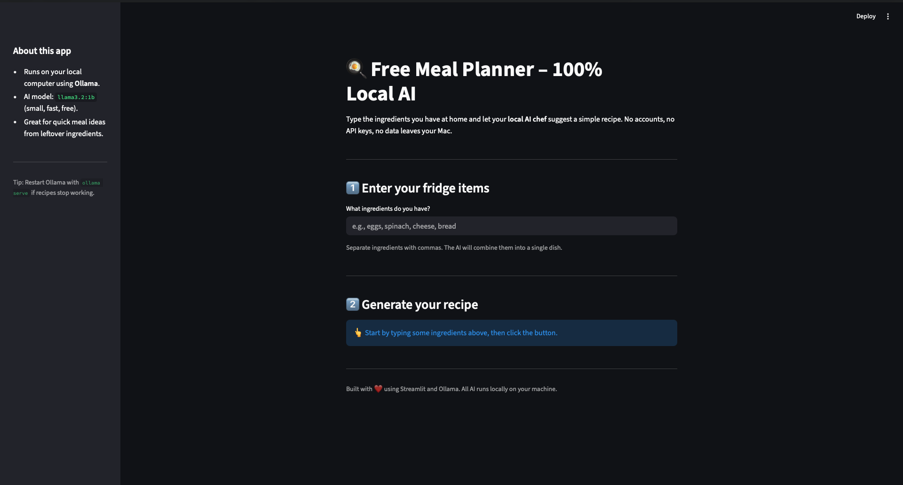
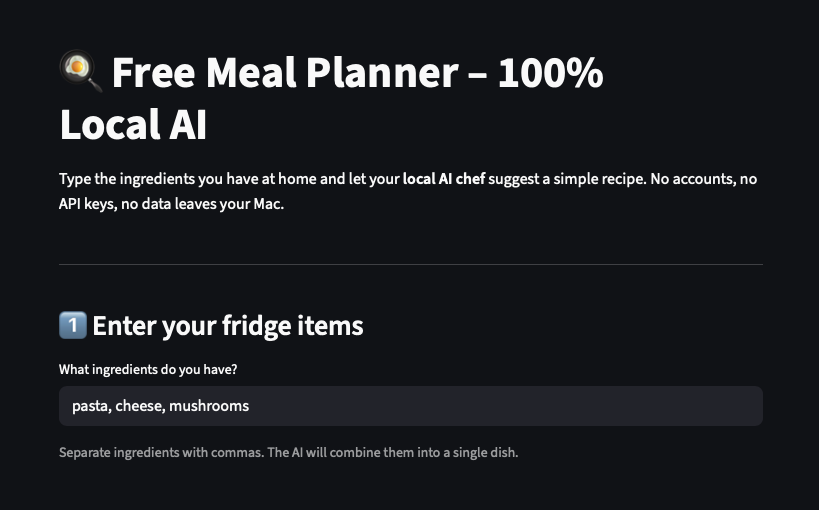
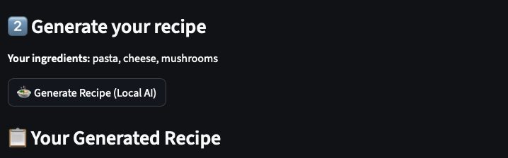
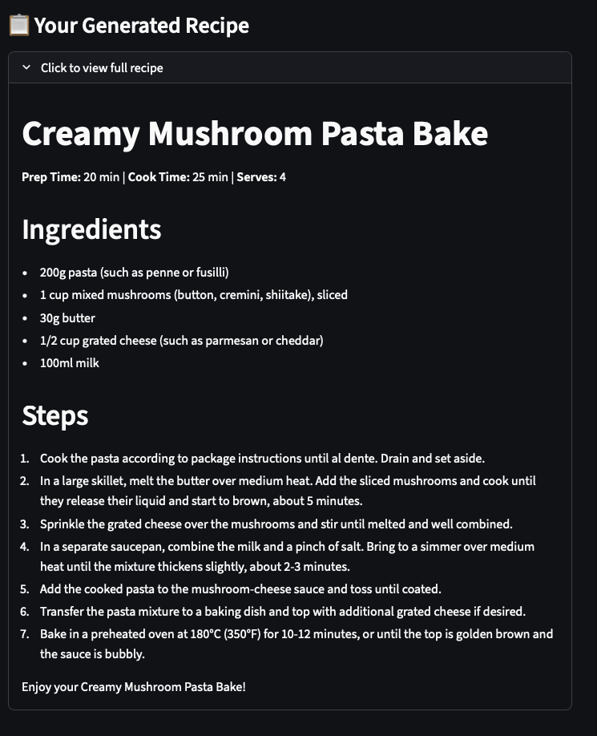

## AI Meal Planner

This project is a Streamlit web app that turns the ingredients in your fridge into a complete meal idea using a local AI model. You type a list of ingredients (for example, `eggs, spinach, cheese, bread`), and the app asks a locally running Ollama model (`llama3.2:1b`) to generate a structured recipe including title, prep and cook time, ingredients list, and step‑by‑step instructions. Because all AI inference happens on your own machine, there are no API keys, no usage fees, and your ingredient data never leaves your computer.

## Screenshots

### Home screen

### Entering ingredients

### Click here to Generate recipe

### Generated recipe

## Run locally (Mac + Ollama)

1. Install [Ollama](https://ollama.com) and pull the model:
brew install ollama
ollama pull llama3.2:1b

2. Clone this repo and create a virtual environment:
git clone https://github.com/rahul10d7/AI Meal Planner.git
cd AI Meal Planner
python3 -m venv venv
source venv/bin/activate
pip install -r requirements.txt

3. In one terminal tab, start Ollama:
ollama serve

4. In another tab, run Streamlit:
streamlit run app.py

